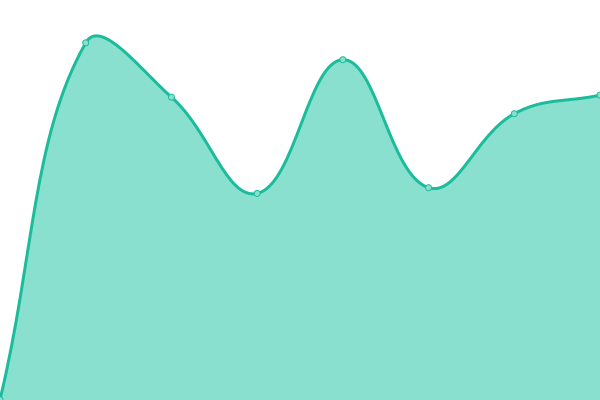
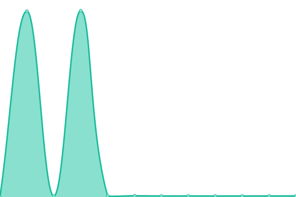
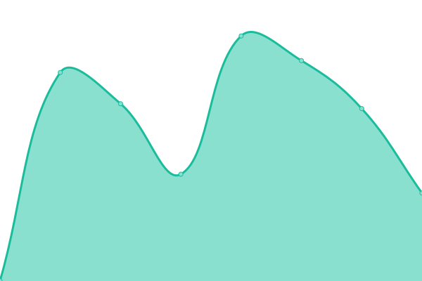
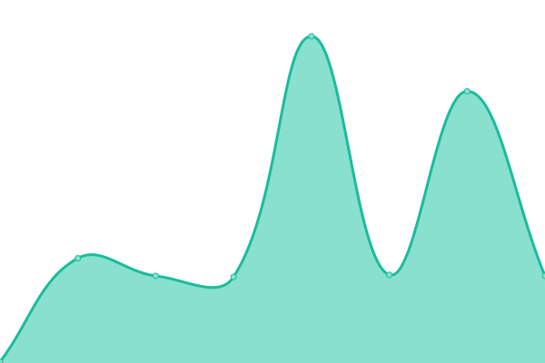
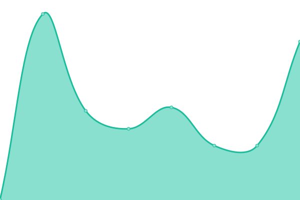
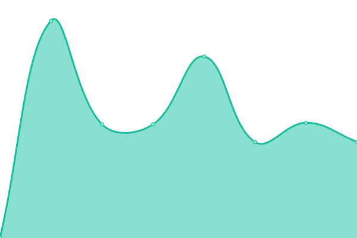
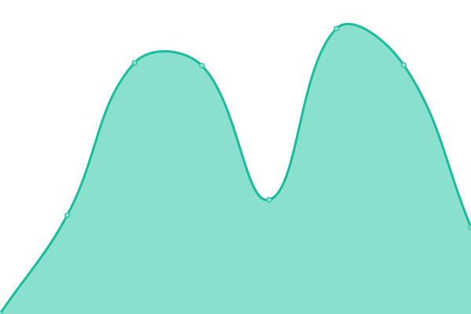

# [📈 Live Status](https://AlexCK-STFC.github.io/stfc-status-page): <!--live status--> **🟧 Partial outage**

This repository contains the open-source uptime monitor and status page for [AlexCK-STFC](https://AlexCK-STFC.github.io/stfc-status-page), powered by [Upptime](https://github.com/upptime/upptime).

With [Upptime](https://upptime.js.org), you can get your own unlimited and free uptime monitor and status page, powered entirely by a GitHub repository. We use [Issues](https://github.com/AlexCK-STFC/stfc-status-page/issues) as incident reports, [Actions](https://github.com/AlexCK-STFC/stfc-status-page/actions) as uptime monitors, and [Pages](https://AlexCK-STFC.github.io/stfc-status-page) for the status page.

<!--start: status pages-->
<!-- This summary is generated by Upptime (https://github.com/upptime/upptime) -->
<!-- Do not edit this manually, your changes will be overwritten -->
<!-- prettier-ignore -->
| URL | Status | History | Response Time | Uptime |
| --- | ------ | ------- | ------------- | ------ |
|  [OpenStack Web UI (Horizon)](https://openstack.stfc.ac.uk) | 🟩 Up | [open-stack-web-ui-horizon.yml](https://github.com/AlexCK-STFC/stfc-status-page/commits/HEAD/history/open-stack-web-ui-horizon.yml) | 

 1418ms
     
 | 

<a href="https://AlexCK-STFC.github.io/stfc-status-page/history/open-stack-web-ui-horizon">99.32%</a>
    

|  [OpenStack Baremetal (Ironic)](https://openstack.stfc.ac.uk:6385) | 🟥 Down | [open-stack-baremetal-ironic.yml](https://github.com/AlexCK-STFC/stfc-status-page/commits/HEAD/history/open-stack-baremetal-ironic.yml) | 

 0ms
     
 | 

<a href="https://AlexCK-STFC.github.io/stfc-status-page/history/open-stack-baremetal-ironic">0.01%</a>
    

|  [OpenStack Baremetal Introspection (Ironic-Inspector)](https://openstack.stfc.ac.uk:5050/) | 🟥 Down | [open-stack-baremetal-introspection-ironic-inspector.yml](https://github.com/AlexCK-STFC/stfc-status-page/commits/HEAD/history/open-stack-baremetal-introspection-ironic-inspector.yml) | 

 0ms
     
 | 

<a href="https://AlexCK-STFC.github.io/stfc-status-page/history/open-stack-baremetal-introspection-ironic-inspector">100.00%</a>
    

|  [OpenStack Cloudformation (Heat-CFN)](https://openstack.stfc.ac.uk:8000/v1) | 🟩 Up | [open-stack-cloudformation-heat-cfn.yml](https://github.com/AlexCK-STFC/stfc-status-page/commits/HEAD/history/open-stack-cloudformation-heat-cfn.yml) | 

 656ms
     
 | 

<a href="https://AlexCK-STFC.github.io/stfc-status-page/history/open-stack-cloudformation-heat-cfn">98.94%</a>
    

|  [OpenStack Compute (Nova)](https://openstack.stfc.ac.uk:8774/v2.1) | 🟩 Up | [open-stack-compute-nova.yml](https://github.com/AlexCK-STFC/stfc-status-page/commits/HEAD/history/open-stack-compute-nova.yml) | 

 6883ms
     
 | 

<a href="https://AlexCK-STFC.github.io/stfc-status-page/history/open-stack-compute-nova">36.31%</a>
    

|  [OpenStack Legacy Compute (Nova Legacy)](https://openstack.stfc.ac.uk:8774/v2) | 🟩 Up | [open-stack-legacy-compute-nova-legacy.yml](https://github.com/AlexCK-STFC/stfc-status-page/commits/HEAD/history/open-stack-legacy-compute-nova-legacy.yml) | 

 6978ms
     
 | 

<a href="https://AlexCK-STFC.github.io/stfc-status-page/history/open-stack-legacy-compute-nova-legacy">34.84%</a>
    

|  [OpenStack EC2 API](https://openstack.stfc.ac.uk:8788/v2/) | 🟥 Down | [open-stack-ec-2-api.yml](https://github.com/AlexCK-STFC/stfc-status-page/commits/HEAD/history/open-stack-ec-2-api.yml) | 

 0ms
     
 | 

<a href="https://AlexCK-STFC.github.io/stfc-status-page/history/open-stack-ec-2-api">0.00%</a>
    

|  [OpenStack Identity (Keystone)](https://openstack.stfc.ac.uk:5000) | 🟩 Up | [open-stack-identity-keystone.yml](https://github.com/AlexCK-STFC/stfc-status-page/commits/HEAD/history/open-stack-identity-keystone.yml) | 

 1392ms
     
 | 

<a href="https://AlexCK-STFC.github.io/stfc-status-page/history/open-stack-identity-keystone">99.68%</a>
    

|  [OpenStack Identity v3 (Keystone v3)](https://openstack.stfc.ac.uk:5000/v3) | 🟩 Up | [open-stack-identity-v3-keystone-v3.yml](https://github.com/AlexCK-STFC/stfc-status-page/commits/HEAD/history/open-stack-identity-v3-keystone-v3.yml) | 

 132ms
     
 | 

<a href="https://AlexCK-STFC.github.io/stfc-status-page/history/open-stack-identity-v3-keystone-v3">99.69%</a>
    

|  [OpenStack Orchestration (Heat)](https://openstack.stfc.ac.uk:8004/v1) | 🟩 Up | [open-stack-orchestration-heat.yml](https://github.com/AlexCK-STFC/stfc-status-page/commits/HEAD/history/open-stack-orchestration-heat.yml) | 

 1819ms
     
 | 

<a href="https://AlexCK-STFC.github.io/stfc-status-page/history/open-stack-orchestration-heat">84.34%</a>
    

|  [OpenStack Volume (Cinder v3)](https://openstack.stfc.ac.uk:8776/v3) | 🟩 Up | [open-stack-volume-cinder-v3.yml](https://github.com/AlexCK-STFC/stfc-status-page/commits/HEAD/history/open-stack-volume-cinder-v3.yml) | 

 1676ms
     
 | 

<a href="https://AlexCK-STFC.github.io/stfc-status-page/history/open-stack-volume-cinder-v3">82.19%</a>
    

|  [OpenStack Load Balancer (Octavia)](https://openstack.stfc.ac.uk:9876) | 🟩 Up | [open-stack-load-balancer-octavia.yml](https://github.com/AlexCK-STFC/stfc-status-page/commits/HEAD/history/open-stack-load-balancer-octavia.yml) | 

 550ms
     
 | 

<a href="https://AlexCK-STFC.github.io/stfc-status-page/history/open-stack-load-balancer-octavia">99.70%</a>
    

|  [OpenStack Shared File System (Manila)](https://openstack.stfc.ac.uk:8786/v1) | 🟥 Down | [open-stack-shared-file-system-manila.yml](https://github.com/AlexCK-STFC/stfc-status-page/commits/HEAD/history/open-stack-shared-file-system-manila.yml) | 

 0ms
     
 | 

<a href="https://AlexCK-STFC.github.io/stfc-status-page/history/open-stack-shared-file-system-manila">0.01%</a>
    

|  [OpenStack Shared File System v2 (Manila v2)](https://openstack.stfc.ac.uk:8786/v2) | 🟥 Down | [open-stack-shared-file-system-v2-manila-v2.yml](https://github.com/AlexCK-STFC/stfc-status-page/commits/HEAD/history/open-stack-shared-file-system-v2-manila-v2.yml) | 

 0ms
     
 | 

<a href="https://AlexCK-STFC.github.io/stfc-status-page/history/open-stack-shared-file-system-v2-manila-v2">0.01%</a>
    

|  [OpenStack Object Store (Swift)](https://s3.echo.stfc.ac.uk/swift/v1) | 🟥 Down | [open-stack-object-store-swift.yml](https://github.com/AlexCK-STFC/stfc-status-page/commits/HEAD/history/open-stack-object-store-swift.yml) | 

 632ms
     
 | 

<a href="https://AlexCK-STFC.github.io/stfc-status-page/history/open-stack-object-store-swift">0.00%</a>
    

|  [OpenStack Image (Glance)](https://openstack.stfc.ac.uk:9292) | 🟩 Up | [open-stack-image-glance.yml](https://github.com/AlexCK-STFC/stfc-status-page/commits/HEAD/history/open-stack-image-glance.yml) | 

 512ms
     
 | 

<a href="https://AlexCK-STFC.github.io/stfc-status-page/history/open-stack-image-glance">21.24%</a>
    

|  [OpenStack Network (Neutron)](https://openstack.stfc.ac.uk:9696) | 🟩 Up | [open-stack-network-neutron.yml](https://github.com/AlexCK-STFC/stfc-status-page/commits/HEAD/history/open-stack-network-neutron.yml) | 

 1257ms
     
 | 

<a href="https://AlexCK-STFC.github.io/stfc-status-page/history/open-stack-network-neutron">21.26%</a>
    

|  [OpenStack Resource Placement](https://openstack.stfc.ac.uk:8778) | 🟥 Down | [open-stack-resource-placement.yml](https://github.com/AlexCK-STFC/stfc-status-page/commits/HEAD/history/open-stack-resource-placement.yml) | 

 0ms
     
 | 

<a href="https://AlexCK-STFC.github.io/stfc-status-page/history/open-stack-resource-placement">0.01%</a>
    

<!--end: status pages-->

[**Visit our status website →**](https://AlexCK-STFC.github.io/stfc-status-page)

## 📄 License

- Powered by: [Upptime](https://github.com/upptime/upptime)
- Code: [MIT](./LICENSE) © [Anand Chowdhary](https://anandchowdhary.com), supported by [Pabio](https://pabio.com)
- Data in the `./history` directory: [Open Database License](https://opendatacommons.org/licenses/odbl/1-0/)
